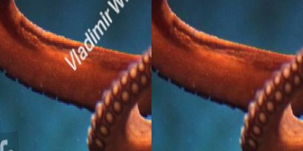
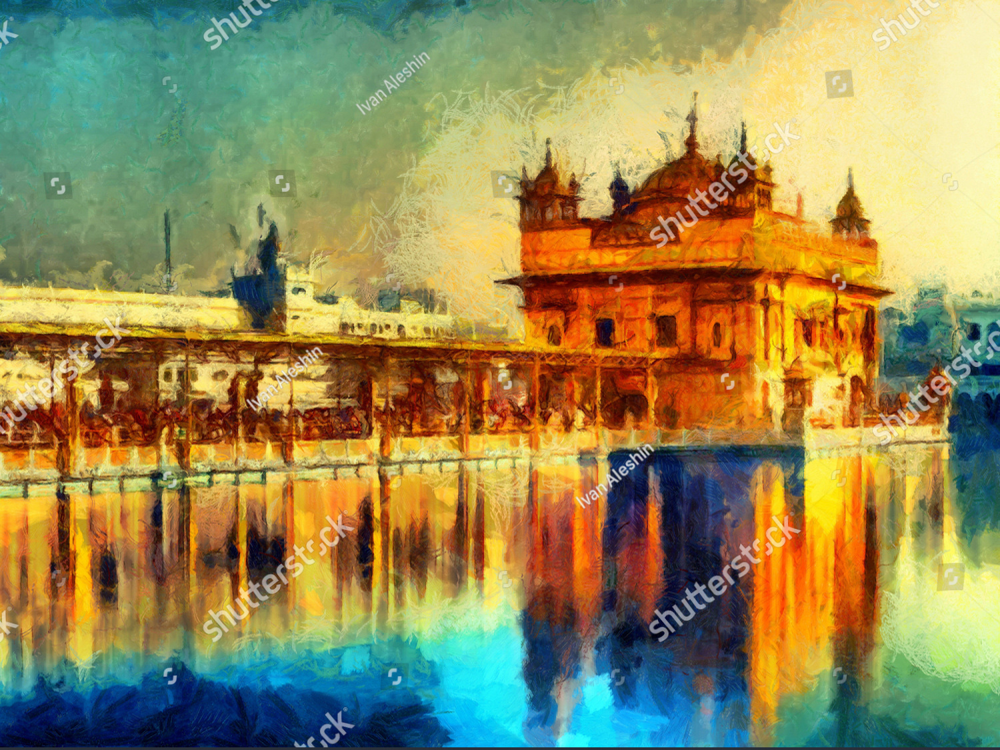
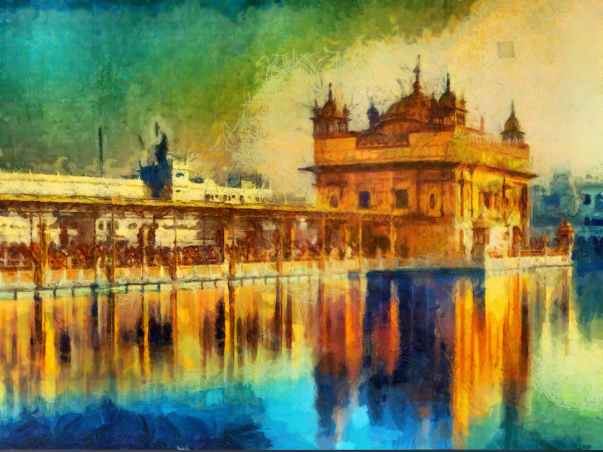
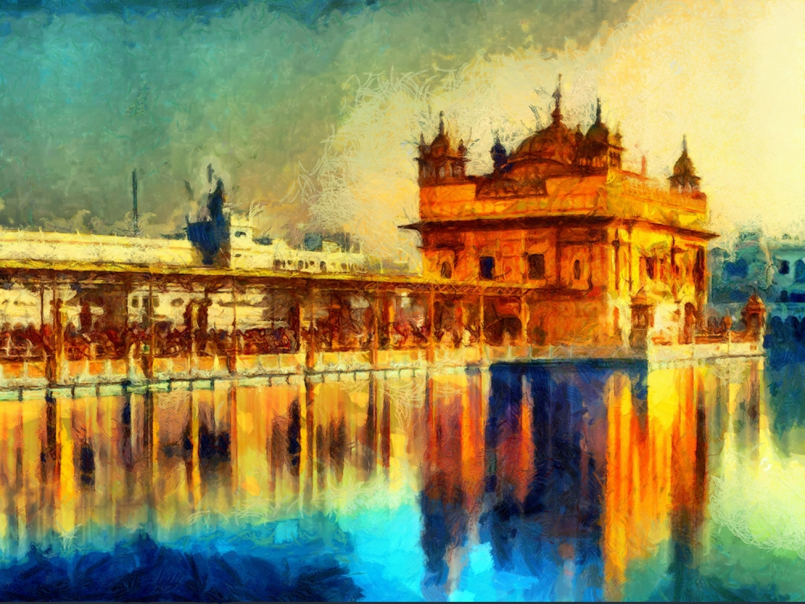

# 
 IMAGE WATERMARK REMOVER WITH PYTORCH 

Trong thế giới số ngày nay, hình ảnh trên Internet thường được bảo vệ bằng cách đặt watermark, làm mờ phần quan trọng của hình để bảo vệ bản quyền và nguồn gốc. 
Tuy nhiên, đôi khi chúng ta cần sử dụng hình ảnh mà không muốn watermark gây ảnh hưởng đến trải nghiệm của chúng ta. 
Trong dự án này, chúng tôi đã triển khai một giải pháp sáng tạo sử dụng mô hình Pix2Pix trong PyTorch để xóa watermark từ hình ảnh một cách hiệu quả.
Sử dụng tập dữ liệu đa dạng từ Shutterstock, chúng tôi đã huấn luyện mô hình để nhận biết và loại bỏ các watermark một cách tự động, mang lại cho bạn những hình ảnh sạch đẹp và tự nhiên mà không cần lo lắng về watermark.
Trong dự án này, chúng tôi triển khai mô hình `Pix2Pix` trong Pytorch để xóa *watermark(hình mờ)* khỏi hình ảnh.
Tập dữ liệu tôi sử dụng được tạo bằng [Bộ dữ liệu hình ảnh từ Shutterstocks](https://shutterstock.com); một bộ dữ liệu chứa hình ảnh có watermark và không có watermark.

## Table of Contents
- [Image Collection](#image-collection)
- [Dataset Creation](#dataset-creation)
- [Model and Training](#model-and-training)
- [Evaluation](#evaluation)
- [Extra Notes](#extra-notes)
- [Resources](#resources)
  - [Models and Training](#models-and-training)

## Image Collection
Khi thực hiện dự án này, điều đầu tiên tôi cần làm là thu thập hình ảnh có chứa watermark và ảnh không chứa watermark nào.
Tôi sử dụng nguồn trang [Shutterstocks](https://shutterstock.com); một bộ dữ liệu chứa hình ảnh có watermark và không có watermark để thu thập các hình ảnh mờ, vì đây là trang có chứa nhiều hình ảnh đa dạng và watermark được xếp hạng là khó nhất trong thang bậc xếp hạng. Sau đó tôi sử dụng một số phương pháp để thu thập những hình ảnh không chứa watermark.

## Dataset Creation
Sau khi thu thập tất cả hình ảnh mà tôi cần (Tôi đã tải xuống khoảng *300 hình ảnh*), từ những hình ảnh này tôi cắt từng ảnh thành những hình ảnh nhỏ hơn để làm dữ liệu cho quá trình training

## Model and Training
- Như đã đề cặp trước, mô hình tôi sử dụng cho dự án này mô hình Pix2Pix. 
- Mô hình Pix2Pix có 2 phần: **Generator** và **Discriminator**.
  + **Generator**  dựa trên mô hình **U-NET** trong đó bạn lấy mẫu xuống rồi lấy mẫu dữ liệu lên. 
  + Đối với **Discriminator** thì nó chỉ là một vài lớp CNN. 

- Tôi cũng đã sử dụng hướng dẫn của *Aladdin* làm tài liệu tham khảo để viết vòng đào tạo cho mô hình của mình. Khi mô hình được huấn luyện, các điểm kiểm tra sẽ được lưu cho **Discriminator** và **Generator** của mô hình cứ sau 5 kỷ nguyên. Hơn nữa, hình ảnh mẫu được lưu cho mỗi kỷ nguyên, hiển thị cho bạn hình ảnh mục tiêu, hình ảnh đầu vào và hình ảnh được tạo. 

## Evaluation
Đào tạo mô hình của tôi mất một thời gian rất dài. Tôi chỉ có thể huấn luyện mô hình của mình trong 300 kỷ nguyên. Do tôi không có tài nguyên để training, nên tôi đã thuê server trên [vast.ai](https://vast.ai/) để training, mỗi kỷ nguyên mất khoảng *12 phút* để đào tạo. Để hoàn thành 300 kỷ nguyên, máy tính của tôi phải mất 60 giờ để hoàn thành. Như đã nói, tôi đã thêm các điểm kiểm tra của mình vào kho lưu trữ này để những người khác có thể tiếp tục đào tạo từ thời điểm đó nếu họ muốn. Ngoài ra, bạn có thể xem mẫu hình ảnh được tạo bên cạnh hình ảnh mục tiêu tại đây:

|Input Image| Generated Image | Target Image |
|-----------|-----------------|--------------|
||||

Nếu tôi có thêm tài nguyên và kinh phí thì tôi sẽ cải thiện độ hài hòa của ảnh đã sinh ra một cách chân thực hơn và thử nhiều pixel hơn.
  

## Resources
### Models and Training
* [Pix2Pix Paper](https://arxiv.org/abs/1611.07004)
